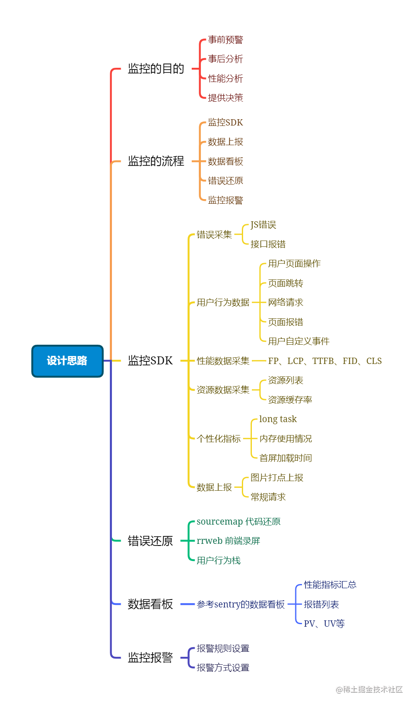

<!--
 * @Author: xx1czj 306205161@qq.com
 * @Date: 2024-04-02 12:23:34
 * @LastEditors: xx1czj 306205161@qq.com
 * @LastEditTime: 2024-04-02 13:52:49
 * @FilePath: /ReviewNotes/md/frontend/monitoring.md
 * @Description: 这是默认设置,请设置`customMade`, 打开koroFileHeader查看配置 进行设置: https://github.com/OBKoro1/koro1FileHeader/wiki/%E9%85%8D%E7%BD%AE
-->
# 前端监控体系


``` bash
// 安装核心模块
$ npm i @websee/core

// 安装性能检测插件
$ npm i @websee/performance

// 安装页面录屏插件
$ npm i @websee/recordscreen
```

## 参考链接
[GitHub直达](https://github.com/xy-sea/blog)