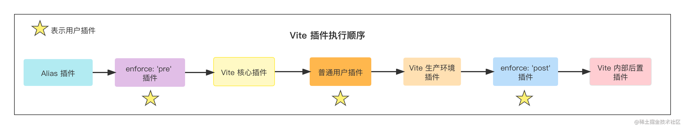

# 开发一个完整的 Vite 插件
## 一个简单的插件示例
Vite 插件与 Rollup 插件结构类似，为一个name和各种插件 Hook 的对象:
``` typescript
{
  // 插件名称
  name: 'vite-plugin-xxx',
  load(code) {
    // 钩子逻辑
  },
}
```
> 如果插件是一个 npm 包，在package.json中的包命名也推荐以vite-plugin开头

一般情况下因为要考虑到外部传参，我们不会直接写一个对象，而是实现一个返回插件对象的工厂函数，如下代码所示:

``` typescript
// myPlugin.js
export function myVitePlugin(options) {
  console.log(options)
  return {
    name: 'vite-plugin-xxx',
    load(id) {
      // 在钩子逻辑中可以通过闭包访问外部的 options 传参
    }
  }
}

// 使用方式
// vite.config.ts
import { myVitePlugin } from './myVitePlugin';
export default {
  plugins: [myVitePlugin({ /* 给插件传参 */ })]
}
```
## 插件 Hook 介绍
1. 通用 Hook
在双引擎架构这一节中介绍过，Vite 开发阶段会模拟 Rollup 的行为

其中 Vite 会调用一系列与 Rollup 兼容的钩子，这个钩子主要分为三个阶段:
- 服务器启动阶段: options和buildStart钩子会在服务启动时被调用。
- 请求响应阶段: 当浏览器发起请求时，Vite 内部依次调用resolveId、load和transform钩子。
- 服务器关闭阶段: Vite 会依次执行buildEnd和closeBundle钩子。

2. 独有 Hook
> 接下来给大家介绍 Vite 中特有的一些 Hook，这些 Hook 只会在 Vite 内部调用，而放到 Rollup 中会被直接忽略。

- 给配置再加点料: config
> Vite 在读取完配置文件（即vite.config.ts）之后，会拿到用户导出的配置对象，然后执行 config 钩子。在这个钩子里面，你可以对配置文件导出的对象进行自定义的操作，如下代码所示:
``` typescript
/ 返回部分配置（推荐）
const editConfigPlugin = () => ({
  name: 'vite-plugin-modify-config',
  config: () => ({
    alias: {
      react: require.resolve('react')
    }
  })
})

// 这个配置对象会和 Vite 已有的配置进行深度的合并
const mutateConfigPlugin = () => ({
  name: 'mutate-config',
  // command 为 `serve`(开发环境) 或者 `build`(生产环境)
  config(config, { command }) {
    // 生产环境中修改 root 参数
    if (command === 'build') {
      config.root = __dirname;
    }

    // 防止出现 undefined 的情况
    config.optimizeDeps = config.optimizeDeps || {}
    config.optimizeDeps.esbuildOptions = config.optimizeDeps.esbuildOptions || {}
    config.optimizeDeps.esbuildOptions.plugins = config.optimizeDeps.esbuildOptions.plugins || []
  }
})
```
3. 获取 Dev Server 实例: configureServer
> 这个钩子仅在开发阶段会被调用，用于扩展 Vite 的 Dev Server，一般用于增加自定义 server 中间件，如下代码所示:
``` typescript
const myPlugin = () => ({
  name: 'configure-server',
  configureServer(server) {
    // 姿势 1: 在 Vite 内置中间件之前执行
    server.middlewares.use((req, res, next) => {
      // 自定义请求处理逻辑
    })
    // 姿势 2: 在 Vite 内置中间件之后执行 
    return () => {
      server.middlewares.use((req, res, next) => {
        // 自定义请求处理逻辑
      })
    }
  }
})
```

4. 转换 HTML 内容: transformIndexHtml
``` typescript
const htmlPlugin = () => {
  return {
    name: 'html-transform',
    transformIndexHtml(html) {
      return html.replace(
        /<title>(.*?)</title>/,
        `<title>换了个标题</title>`
      )
    }
  }
}
// 也可以返回如下的对象结构，一般用于添加某些标签
const htmlPlugin = () => {
  return {
    name: 'html-transform',
    transformIndexHtml(html) {
      return {
        html,
        // 注入标签
        tags: [
          {
            // 放到 body 末尾，可取值还有`head`|`head-prepend`|`body-prepend`，顾名思义
            injectTo: 'body',
            // 标签属性定义
            attrs: { type: 'module', src: './index.ts' },
            // 标签名
            tag: 'script',
          },
        ],
      }
    }
  }
}

// 热更新处理: handleHotUpdate
const handleHmrPlugin = () => {
  return {
    async handleHotUpdate(ctx) {
      // 需要热更的文件
      console.log(ctx.file)
      // 需要热更的模块，如一个 Vue 单文件会涉及多个模块
      console.log(ctx.modules)
      // 时间戳
      console.log(ctx.timestamp)
      // Vite Dev Server 实例
      console.log(ctx.server)
      // 读取最新的文件内容
      console.log(await read())
      // 自行处理 HMR 事件
      ctx.server.ws.send({
        type: 'custom',
        event: 'special-update',
        data: { a: 1 }
      })
      return []
    }
  }
}

// 前端代码中加入
if (import.meta.hot) {
  import.meta.hot.on('special-update', (data) => {
    // 执行自定义更新
    // { a: 1 }
    console.log(data)
    window.location.reload();
  })
}
```

``` typescript
// test-hooks-plugin.ts
// 注: 请求响应阶段的钩子
// 如 resolveId, load, transform, transformIndexHtml在下文介绍
// 以下为服务启动和关闭的钩子
export default function testHookPlugin () {
  return {
    name: 'test-hooks-plugin', 
    // Vite 独有钩子
    config(config) {
      console.log('config');
    },
    // Vite 独有钩子
    configResolved(resolvedCofnig) {
      console.log('configResolved');
    },
    // 通用钩子
    options(opts) {
      console.log('options');
      return opts;
    },
    // Vite 独有钩子
    configureServer(server) {
      console.log('configureServer');
      setTimeout(() => {
        // 手动退出进程
        process.kill(process.pid, 'SIGTERM');
      }, 3000)
    },
    // 通用钩子
    buildStart() {
      console.log('buildStart');
    },
    // 通用钩子
    buildEnd() {
      console.log('buildEnd');
    },
    // 通用钩子
    closeBundle() {
      console.log('closeBundle');
    }
}
```
## 参考链接
[腾讯](https://cloud.tencent.com/developer/article/2360915)
## 插件应用执行生命周期
