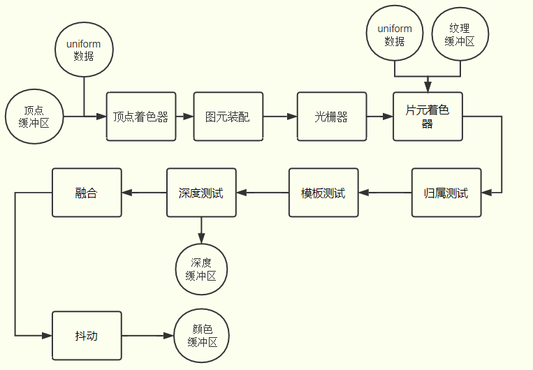

<!--
 * @Author: xx1czj 306205161@qq.com
 * @Date: 2024-04-07 11:35:31
 * @LastEditors: xx1czj 306205161@qq.com
 * @LastEditTime: 2024-04-07 11:38:45
 * @FilePath: /ReviewNotes/md/frontend/webGL.md
 * @Description: 这是默认设置,请设置`customMade`, 打开koroFileHeader查看配置 进行设置: https://github.com/OBKoro1/koro1FileHeader/wiki/%E9%85%8D%E7%BD%AE
-->
# WebGL零基础快速入门
## 渲染管线流程图

## webGL相关学习资源

[中文学习](http://www.yanhuangxueyuan.com/WebGL/)
