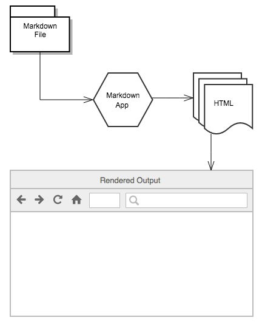
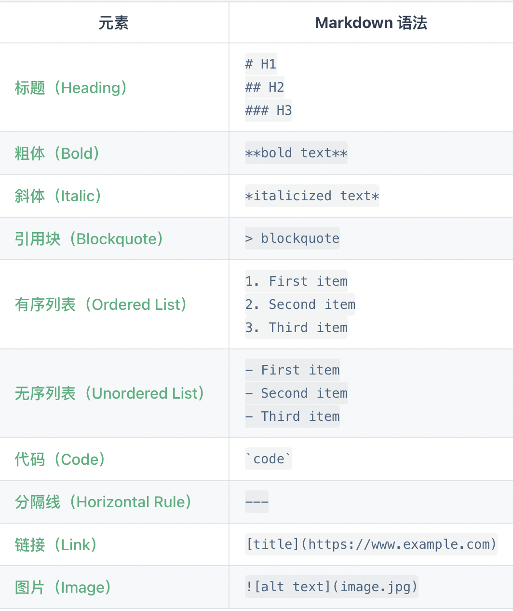
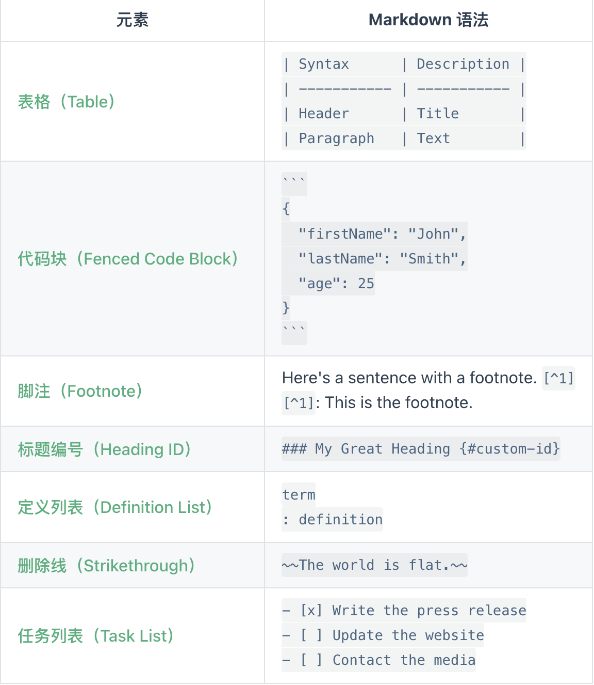

<!--
 * @Author: xx1czj 306205161@qq.com
 * @Date: 2024-03-25 10:33:30
 * @LastEditors: xx1czj 306205161@qq.com
 * @LastEditTime: 2024-03-25 11:25:25
 * @FilePath: /ReviewNotes/md/readMe.md
 * @Description: 用于指导使用文档规范
-->
# Markdown 官方教程 [官方地址](https://markdown.com.cn/)
``` description 
Markdown 速查表提供了所有 Markdown 语法元素的基本解释。
```
## Markdown 是什么
``` description
Markdown 是一种轻量级的标记语言，可用于在纯文本文档中添加格式化元素。Markdown 由 John Gruber 于 2004 年创建，如今已成为世界上最受欢迎的标记语言之一。

1. 专注于文字内容；
2. 纯文本，易读易写，可以方便地纳入版本控制；
3. 语法简单，没有什么学习成本，能轻松在码字的同时做出美观大方的排版。
```

## 为什么要使用 Markdown
``` description
使用 Markdown 而不是 word 类编辑器的原因有：

    1. Markdown 无处不在。StackOverflow、CSDN、掘金、简书、GitBook、有道云笔记、V2EX、光谷社区等。主流的代码托管平台，如 GitHub、GitLab、BitBucket、Coding、Gitee 等等，都支持 Markdown 语法，很多开源项目的 README、开发文档、帮助文档、Wiki 等都用 Markdown 写作。

    2. Markdown 是纯文本可移植的。几乎可以使用任何应用程序打开包含 Markdown 格式的文本文件。如果你不喜欢当前使用的 Markdown 应用程序了，则可以将 Markdown 文件导入另一个 Markdown 应用程序中。这与 Microsoft Word 等文字处理应用程序形成了鲜明的对比，Microsoft Word 将你的内容锁定在专有文件格式中。

    3. Markdown 是独立于平台的。你可以在运行任何操作系统的任何设备上创建 Markdown 格式的文本。

    4. Markdown 能适应未来的变化。即使你正在使用的应用程序将来会在某个时候不能使用了，你仍然可以使用文本编辑器读取 Markdown 格式的文本。当涉及需要无限期保存的书籍、大学论文和其他里程碑式的文件时，这是一个重要的考虑因素。
```

## Markdown 有什么用
``` description
Markdown 是做笔记、为网站创建内容以及生成可打印文档的快速、简便的方法。
```

## Markdown 的工作原理
> - 文本内容存储在带有 .md 或 .markdown 扩展名的纯文本文件中 。
> - 需要一个能够处理 Markdown 文件的 Markdown 应用程序。 应用程序使用一种称为 Markdown 处理器（也通常称为“解析器”或“实现”）



## 使用命令简介


- 基础语法 [官方地址](https://markdown.com.cn/basic-syntax/paragraphs.html)

## 推荐工具
- OSX
    1. Typora [官方地址](https://www.typora.io/)
- Windows
    1. Typora [官方地址](https://www.typora.io/)

## 在线编辑
- Markdown [官方地址](https://markdown.com.cn/editor/)
- CodeMirror [官方地址](https://codemirror.net/)
- Dillinger [官方地址](https://dillinger.io/)
- Markgiu [官方地址](https://github.com/bianchimro/markgiu)

## 不懂运用可参考
- 基础知识 [官方地址](https://experienceleague.adobe.com/zh-hans/docs/contributor/contributor-guide/writing-essentials/markdown)
- Runoob [官方地址](https://www.runoob.com/markdown/md-title.html)