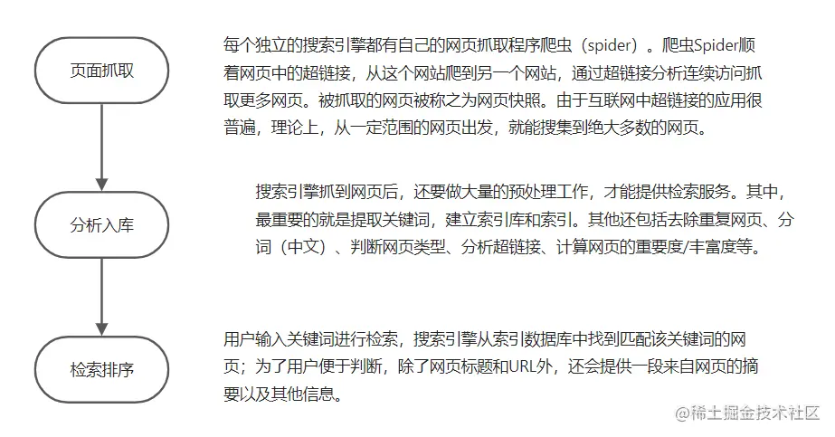

<!--
 * @Author: xx1czj 306205161@qq.com
 * @Date: 2024-03-26 11:52:11
 * @LastEditors: xx1czj 306205161@qq.com
 * @LastEditTime: 2024-03-26 12:11:36
 * @FilePath: /ReviewNotes/md/seo.md
 * @Description: 这是默认设置,请设置`customMade`, 打开koroFileHeader查看配置 进行设置: https://github.com/OBKoro1/koro1FileHeader/wiki/%E9%85%8D%E7%BD%AE
-->
# 前端系统SEO方案
## 简介
> SEO(Search Engine Optimization)，即搜索引擎优化。是指是为了提升网页在搜索引擎自然搜索结果中的收录数量以及排序位置而做的优化行为（网站Web结构调整、网站内容建设、网站代码优化和编码等和站外优化)。而优化的目的就是为了提升网站在搜索引擎中的权重，增加对搜索引擎的友好度，使得用户在访问网站时能排在前面。

1. 对网站的标题、关键字、描述精心设置，反映网站的定位，让搜索引擎明白网站是做什么的；
2. 网站内容优化：内容与关键字的对应，增加关键字的密度；
3. 在网站上合理设置Robot.txt文件；
4. 生成针对搜索引擎友好的网站地图；
5. 增加外部链接，到各个网站上宣传。

## 搜索引擎工作原理

## 为什么要做SEO
提高网站的权重，增强搜索引擎友好度，以达到提高排名，增加流量，吸引更多目标客户点击访问网站，从而达到互联网营销及品牌建设的目标。

## 优化策略
### 合理使用HTML语义化标签；
> 在构建网页时，使用语义化的HTML标签，如\<header>、\<nav>、\<article>等，能够更清晰地表达页面结构。这有助于搜索引擎更好地理解网页内容，提高页面的可读性和排名。语义化标签的使用也使得网站在各种设备上的呈现更为一致。
### 优化页面加载速度；
> 搜索引擎更倾向于排名加载速度快的页面。通过压缩图片、合并和压缩CSS和JavaScript文件、减少HTTP请求等手段，优化页面加载速度。使用工具如Google PageSpeed Insights检查并提供性能优化建议。快速加载的页面不仅对搜索引擎友好，也提升用户体验。
### 响应式设计和移动友好性；
> 确保网站采用响应式设计，适应不同设备和屏幕大小。Google等搜索引擎更注重移动友好的网站，并在搜索排名中给予移动友好性较高的权重。移动端的友好性是提升搜索排名和吸引移动用户的重要因素。
### 创建清晰的URL结构；
> URL应该简洁、清晰，包含关键字，并且易于理解。避免使用过长、难懂的URL。使用短横线（-）而不是下划线（_）分隔单词。清晰的URL结构有助于搜索引擎理解页面主题和内容。
### 优化页面标题和Meta标签；
> 每个页面应该有独特而相关的标题，包含关键字，并尽量不超过70个字符。Meta标签中的描述应该吸引用户点击，并包含关键字。确保这些标签对页面内容准确反映，提高搜索引擎抓取的效果。
### 有效利用头部标签等。在构建网页时，使用语义化的HTML标签，如\<header>、\<nav>、\<article>等，能够更清晰地表达页面结构。
> 使用H1标签来定义页面主标题，H2、H3等标签来划分子标题。这有助于搜索引擎理解页面结构，提高关键词的权重。通过合理使用头部标签，突显关键信息，有助于提高页面在搜索结果中的可见性。
### 利用Alt属性优化图片
> 在所有图片上使用Alt属性，描述图片内容。这不仅有助于搜索引擎了解图片，也提供了在图片无法加载时的文字描述，提升用户体验。优化图片描述有助于搜索引擎理解页面内容，提高图片搜索的可靠性。
### 创建XML站点地图
> 生成XML站点地图并提交给搜索引擎。这有助于搜索引擎更快地发现和索引网站中的所有页面，提高页面被检索到的概率。站点地图是指引搜索引擎爬虫有效遍历网站的重要工具。
### 合理使用内部链接
> 在网站内部使用合理的链接结构，使用关键字作为锚文本。这有助于搜索引擎理解页面之间的关系，提高关键字的权重。通过合理的内部链接，分布页面的权重，有助于提升整体网站的SEO效果。
### 持续监测和更新
> 定期监测网站的SEO性能，使用工具如Google Analytics和Google Search Console。根据数据分析结果，进行必要的调整和更新，以适应搜索引擎算法的变化和提高网站的可见性。SEO是一个持续优化的过程，需要不断关注和调整，以适应搜索引擎的变化和提升网站的排名。
## 网站内容优化
### SR的实现方式
- 单页面应用无法抓取内容
  1. vue-ssr
  2. nuxt.js
  3. 预渲染 prerender-spa-plugin + vue-meta-info；
- 合理的设计title、description和keywords
  1. 标题：只强调重点即可，尽量把重要的关键词放在前面，关键词不要重复出现，尽量做到每个页面的\<title>标题中不要设置相同的内容。
  2. 标签：关键词，列举出几个页面的重要关键字即可，切记过分堆砌。
  3. 标签：网页描述，需要高度概括网页内容，切记不能太长，过分堆砌关键词，每个页面也要有所不同。
- 提高页面关键词密度
  1. URL中出现关键词（英文）
  2. 网页标题中出现关键词（1-3个）
  3. 关键词标签中出现关键词（1-3个）
  4. 描述标签中出现关键词（主关键词重复2次）
  5. 内容中自然出现关键词
  6. 内容第一段和最后一段出现关键词
  7. H1，H2标签中出现关键词
  8. 导出链接锚文本中包含关键词
  9. 图片的文件名包含关键词
  10. ALT属性中出现关键词
  11. 关键词密度2-8%
  12. 对关键词加粗或斜体
- 语义化标签
  1. 让阅读源码者和“蜘蛛”都一目了然。比如：h1-h6 是用于标题类的标签是用来设置页面主导航的等。
- 链接
  1. a标签：页内链接，要加 “title” 属性加以说明，让访客和 “蜘蛛” 知道。而外部链接，链接到其他网站的，则需要加上 el="nofollow" 属性, 告诉 “蜘蛛” 不要爬，因为一旦“蜘蛛”爬了外部链接之后，就不会再回来了。
  2. 内链采用绝对路径，减少响应时间，避免出现死链接，减少给搜索引擎堵塞。
  3. 页面跳转尽量使用a标签，而不是js控制跳转。
- 其他
  1. 正文标题要用h1标签：h1标签自带权重“蜘蛛” 认为它最重要，一个页面有且最多只能有一个H1标签，放在该页面最重要的标题上面，如首页的logo上可以加H1标签。副标题用h2标签, 而其它地方不应该随便乱用 h 标题标签。
  2. 应使用 "alt" 属性加以说明
  3. 尽量少使用iframe框架,因为“蜘蛛”一般不会读取其中的内容。
  4. 设置好404页面，减少网站跳出率。
  5. 重要内容不要用js输出，因为蜘蛛不会执行js
  6. 巧妙布局，将重要内容放在html文档前面，让蜘蛛优先读取。
## 网站结构优化
> 网站结构布局优化：尽量简单、开门见山，提倡扁平化结构
- 控制首页链接数量(建议首页链接在100个以内)
- 扁平化的目录层次(尽量让“蜘蛛”只要跳转3次，就能到达网站内的任何一个内页。)
- 导航优化(导航应该尽量采用文字方式，也可以搭配图片导航，但是图片代码一定要进行优化，标签必须添加“alt”和“title”属性，告诉搜索引擎导航的定位)
- 建立网站地图，方案推荐： sitemap.js 高级站点地图生成框架，可以轻松创建站点地图XML文件

## 站外优化
  1. 高质量的内容
  产生高质量的外部链接最好的方法就是书写高质量的内容，站长们的文章能够让读者产生阅读的欲望而对文章进行转载
  2. 合作伙伴、链接交换
  与合作伙伴互相推荐链接。与行业网站、相关性网站进行链接
  3. 分类目录
  将网站提交到DMOZ目录、Yahoo目录和ODP目录一些专业目录网站
  4. 社会化书签
  将网站加入百度收藏、雅虎收藏、Google书签、QQ书签等社会化书签
  5. 发布博客创建链接
  目前获取外部链接最有效的方式之一就是通过发布博客文章